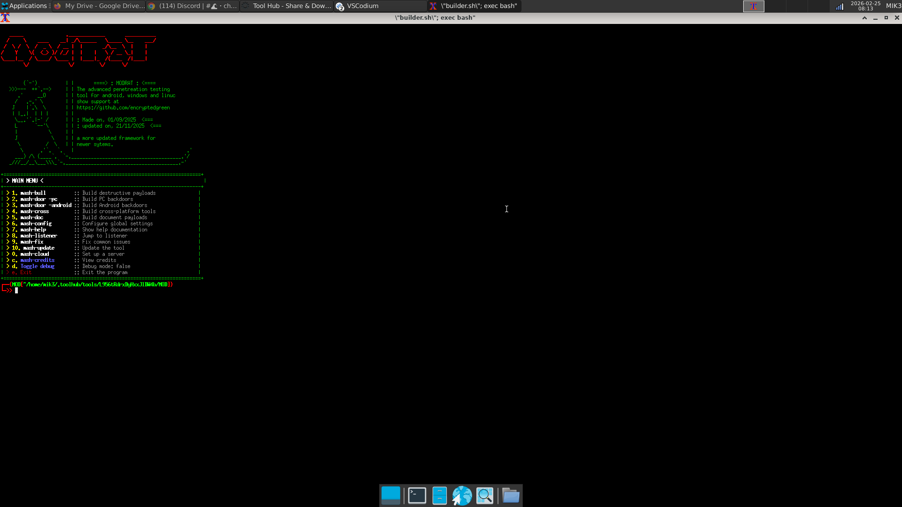
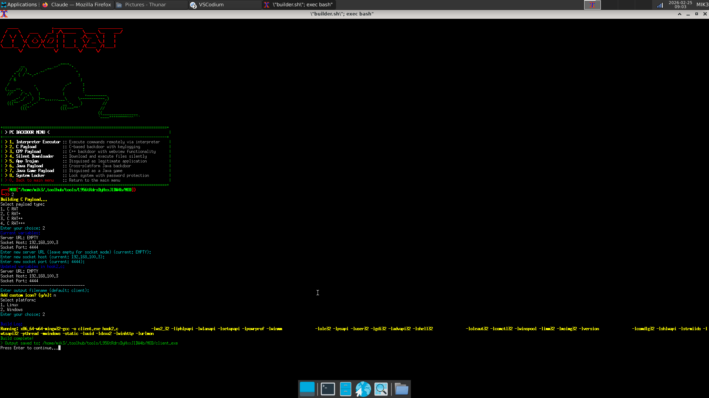
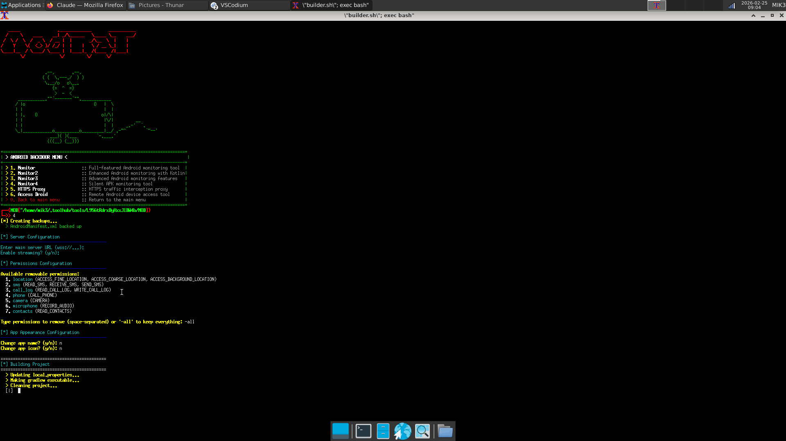
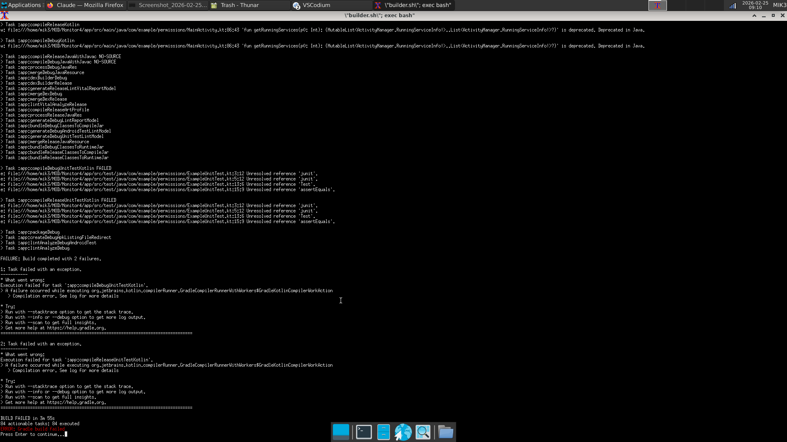
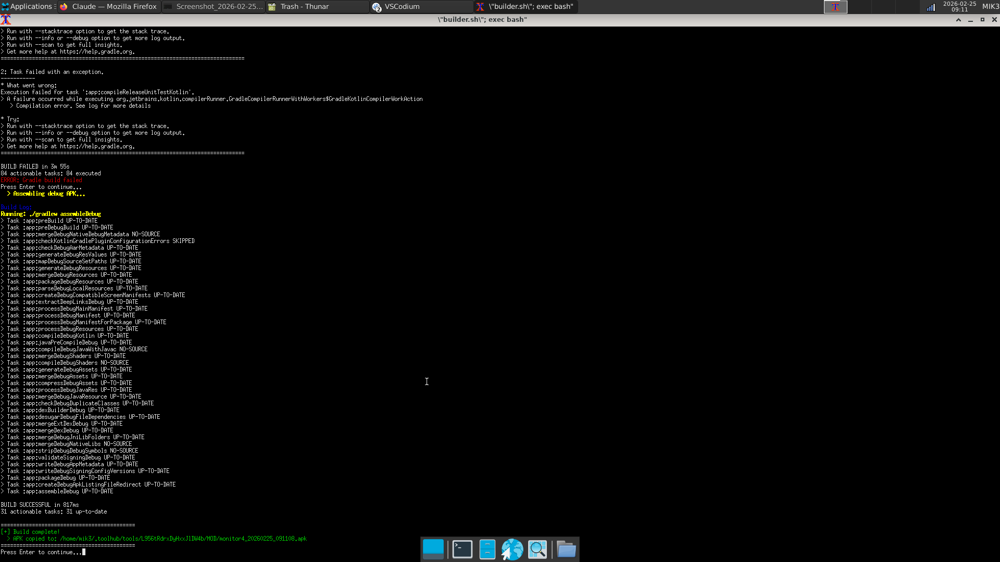
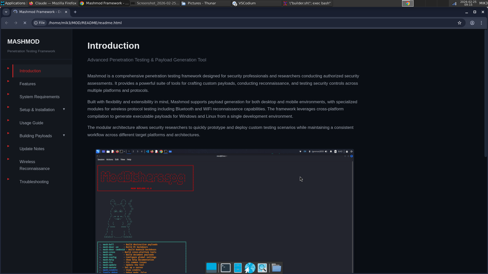

<p align="center">
  
</p>

<h1 align="center" style="font-size: 3em; font-weight: bold; letter-spacing: 2px; margin-top: 5px; color: #2c3e50;">RAT</h1>
<h3 align="center" style="font-weight: normal; color: #7f8c8d; margin-top: -10px;">Remote Administration Tool</h3>

<p align="center">
  
  
  
  
</p>

<p align="center">
  
  
  
</p>

---

A penetration testing framework I built over 2 months. Fully modular payload system like Metasploit. Can build payloads for Windows, Linux and Android. Supports ws, wss, http, https, tcp protocols. More payloads coming in the future.

## Features

- **Modular Payload System** - Stagers and payloads can be mixed and matched
- **Cross-Platform Support** - Windows (.exe), Linux (binary), Android (.apk)
- **Multi-Protocol Listeners** - ws, wss, http, https, tcp
- **Session Management** - Interact with active agents
- **Extensible** - Easy to add new payloads and protocols

## Architecture

The payload system works in stages:
- **Stager** - Small initial payload that connects back and fetches the main agent
- **Payload** - Full agent with post-exploitation functionality

This keeps the initial footprint small while allowing complex functionality.

## Screenshots

| | |
|---|---|
| **Main Menu** | **Windows Build** |
|  |  |
| **Android Build** | **Listeners** |
|  |  |
| **Active Sessions** | **Build Guide** |
|  |  |

## Installation

```bash
# Clone the repository
git clone https://github.com/Mikezx8/RAT.git
mv RAT MOD
cd MOD
chmod +x setup.sh
./setup.sh
```

## Basic Usage

1. **Start a listener**
   ```
   >_ listeners
   listeners >_ create
   ```

2. **Generate a payload**
   ```
   >_ build_windows
   LHOST: 192.168.1.100
   LPORT: 443
   Protocol: https
   ```

3. **Deploy and interact**
   ```
   >_ sessions
   sessions >_ interact 1
   ```

## Build Commands

- `build_windows` - Generate Windows executable
- `build_linux` - Generate Linux binary  
- `build_android` - Generate Android APK

## Supported Protocols

- `ws` - WebSocket
- `wss` - Secure WebSocket
- `http` - HTTP
- `https` - HTTPS
- `tcp` - Raw TCP

## Roadmap

- More payload modules
- Additional protocols (DNS, ICMP)
- Encrypted communication
- Pivoting support

## Disclaimer

This tool is for authorized security testing and educational purposes only. Unauthorized access to computer systems is illegal. I am not responsible for misuse.

---

<p align="center">
  More features coming soon.
</p>
